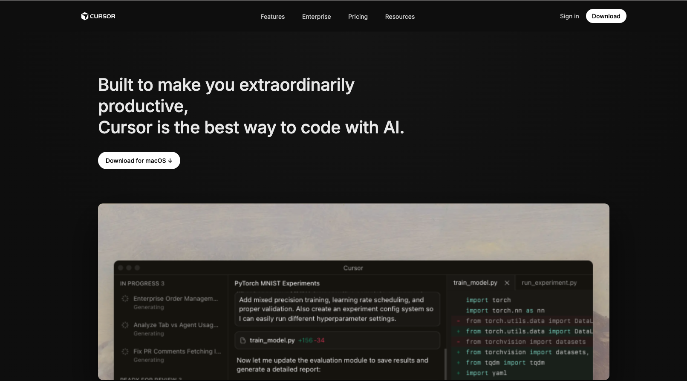

# Cursor Landing Page – Visual Clone (Desktop)

This project is a **desktop-first visual and structural recreation** of the Cursor website hero page, created as part of a frontend UI replication assignment.

The goal of this project is **visual accuracy**, not creativity or interactivity.

---

## ✅ Sections Recreated

The following sections from the original Cursor website were recreated:

1. **Top Navigation Bar**
   - Cursor logo
   - Navigation links (Features, Enterprise, Pricing, Resources)
   - Primary CTA buttons (Sign in, Download)
   - Dark background and spacing matching the original layout

2. **Hero Section**
   - Main headline text
   - Primary call-to-action button ("Download for macOS")
   - Gradient dark background
   - Large centered product UI screenshot
   - Typography, spacing, and alignment matched closely to the reference

> Note: This submission focuses on **exact replication of the hero page shown in the reference image**.

---

## 🔤 Fonts Used

- **Inter**
  - Source: Google Fonts
  - Font Weights Used: `400`, `500`, `600`
  - Reason: Inter is the primary font used by Cursor and closely matches the original typography.

```css
font-family: "Inter", sans-serif;
```

## Screenshots


